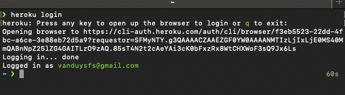

## Which purpose Heroku is used for?
- Heroku is a cloud platform that lets you deploy, run and manage applications written in Java, PHP ...

- 

## How to deploy your app on Heroku
### 1. Set up
#### a. Create a Heroku account
- First of all, we need to create an account:  
Check this link and register a free account
> https://signup.heroku.com/dc  

- Choose your project language at 'Primary development language'. At this tuotorial, we will focus on Java and PHP as two basic demos.  
- After signing up successfully, an requested email containing a link will be sent to you to active your account. Check the link and set your account password.
- At the beginning screen, we can try creating a new app or a team by GUI but this will be mentioned in the appendix.

  

#### b. Install Heroku CLI
- In the scope of this tutorial, we will use `The Heroku CLI` (Command Line Interface) to manage and scale your applications, provision add-ons, view your application logs, and run your application locally.
- Heroku CLI requires Git, so need to install Git at first.
- Install CLI:
    - On MacOS terminal:  
        >$ brew install heroku/brew/heroku
    - On Windows:
        >Down load the installer from this [LINK](https://cli-assets.heroku.com/heroku-x64.exe)
- When the intallation completes, we can use Heroku commands on Terminal. Log in Heroku by using `$ heroku login` to open your web browser to the Heroku login page. If you are already logged in before, just click the `Log in` button, then back to terminal to check result.  

- Now we ready to deploy your app on Heroku:
    - Deploy Java app
    - Deploy PHP app